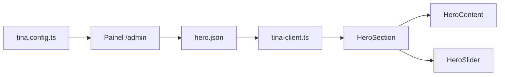

# 🎨 TinaCMS - Guia de Uso

> **Como editar o conteúdo do site de forma visual, sem tocar no código**

---

## 📋 Índice

1. [O que é TinaCMS?](#o-que-é-tinacms)
2. [Como Acessar o Painel](#como-acessar-o-painel)
3. [Editando a Hero Section](#editando-a-hero-section)
4. [Estrutura de Arquivos](#estrutura-de-arquivos)
5. [Próximas Seções](#próximas-seções)
6. [Deploy e Produção](#deploy-e-produção)

---

## O que é TinaCMS?

TinaCMS é um **CMS headless git-backed** que permite editar conteúdo do site de
forma visual através de um painel administrativo (`/admin`).

**Vantagens:**

- ✅ Edição visual sem tocar no código
- ✅ Mudanças salvas como commits no Git
- ✅ Preview em tempo real
- ✅ Tipagem TypeScript automática
- ✅ Suporte para imagens, rich text, listas, etc.

---

## Como Acessar o Painel

### Desenvolvimento Local

1. **Inicie o servidor:**

   ```bash
   npm run dev
   ```

2. **Acesse o painel:**

   ```
   http://localhost:3002/admin
   ```

3. **Modo Local (sem autenticação):**
   - Por padrão, o Tina funciona em "modo local"
   - Você edita arquivos diretamente em `src/content/sections/`
   - Mudanças aparecem instantaneamente

### Produção (TinaCloud)

Para usar em produção com autenticação:

1. Criar conta em [tina.io](https://tina.io)
2. Configurar variáveis de ambiente:
   ```env
   NEXT_PUBLIC_TINA_CLIENT_ID=seu_client_id
   TINA_TOKEN=seu_token_privado
   NEXT_PUBLIC_BRANCH=main
   ```
3. Acessar `/admin` e fazer login

---

## Editando a Hero Section

### 📍 O que é editável?

A Hero Section (primeira seção do site com imagens de fundo) tem os seguintes
campos editáveis:

| Campo                | Tipo             | Descrição                            |
| -------------------- | ---------------- | ------------------------------------ |
| **Título Principal** | Texto            | Título grande em maiúsculas          |
| **Subtítulo**        | Texto            | Texto secundário em dourado          |
| **Descrição**        | Texto longo      | Parágrafo descritivo                 |
| **Texto do Botão**   | Texto            | Label do CTA button                  |
| **Link do Botão**    | Texto            | URL/âncora do botão (ex: `#contato`) |
| **Slides**           | Lista de Imagens | Carrossel de imagens de fundo        |

### 🎯 Passo a Passo

1. **Acesse** `http://localhost:4001` (após rodar `npm run dev:tina`)

2. **Na barra lateral**, clique em **"Hero Section"**

3. **Edite os campos:**
   - Digite no formulário à direita
   - Preview aparece instantaneamente à esquerda

4. **Gerenciar Slides:**
   - Clique em **"Slides da Hero"**
   - **Adicionar slide:** Botão "Add Item"
   - **Editar slide:** Clique no item da lista
   - **Deletar slide:** Ícone de lixeira
   - **Reordenar:** Drag and drop

5. **Upload de Imagens:**
   - No campo "Imagem", clique no ícone de upload
   - Escolha arquivo do computador
   - Imagens vão para `public/uploads/`

6. **Salvar Mudanças:**
   - Modo Local: Clica em "Save" → arquivo JSON é atualizado
   - TinaCloud: Cria um commit ou pull request

### 📝 Exemplo de Conteúdo

```json
{
  "title": "CONSTRUIR NUNCA FOI TÃO TRANQUILO",
  "subtitle": "Transformando desafios em soluções eficientes",
  "description": "Somos uma empresa especializada em gestão de projetos...",
  "ctaLabel": "Solicitar Orçamento",
  "ctaHref": "#contato",
  "slides": [
    {
      "id": "slide-1",
      "image": "/img/hero-1.jpg",
      "alt": "Projeto de construção Geplano"
    }
  ]
}
```

---

## Estrutura de Arquivos

### Onde está o conteúdo?

```
src/content/sections/
└── hero.json          ← Conteúdo editável da Hero Section
```

### Como funciona o fluxo?

1. **Conteúdo** está em `hero.json`
2. **Schema** definido em `tina.config.ts` (campos do formulário)
3. **Client helper** em `src/lib/tina-client.ts` (busca dados)
4. **Componente** `HeroSection` renderiza os dados

### Arquitetura



---

## Próximas Seções

A implementação atual tem **apenas a Hero Section** configurada.

### Como adicionar outras seções?

#### 1. About Section

Criar `src/content/sections/about.json`:

```json
{
  "title": "Quem Somos",
  "description": "...",
  "stats": [{ "number": "500+", "label": "Projetos Concluídos" }]
}
```

#### 2. Features Section

Criar `src/content/sections/features.json`:

```json
{
  "title": "Nosso App",
  "features": [
    {
      "icon": "shield",
      "title": "Segurança",
      "description": "..."
    }
  ]
}
```

#### 3. Contact Section

Criar `src/content/sections/contact.json`:

```json
{
  "title": "Entre em Contato Conosco",
  "email": "pedrolucasmota2005@gmail.com",
  "phone": "(11) 99999-9999"
}
```

### Padrão para novas seções

Para cada nova seção:

1. **Criar JSON** em `src/content/sections/[nome].json`
2. **Adicionar collection** no `tina.config.ts`
3. **Criar interface** no arquivo de tipos
4. **Criar função helper** em `tina-client.ts`
5. **Refatorar componente** para usar dados dinâmicos

---

## Deploy e Produção

### Vercel (Recomendado)

1. **Push para GitHub:**

   ```bash
   git add .
   git commit -m "feat: Add TinaCMS to Hero Section"
   git push
   ```

2. **Deploy na Vercel:**
   - Conectar repositório
   - Adicionar variáveis de ambiente (se usar TinaCloud)
   - Deploy automático

3. **Configurar TinaCloud:**
   - Criar projeto em tina.io
   - Conectar ao repositório GitHub
   - Configurar branch de produção
   - Copiar Client ID e Token para Vercel

### Variáveis de Ambiente Necessárias

```env
# TinaCloud (Produção)
NEXT_PUBLIC_TINA_CLIENT_ID=seu_client_id_aqui
TINA_TOKEN=seu_token_privado_aqui
NEXT_PUBLIC_BRANCH=main

# Revalidação
REVALIDATE_SECRET=seu_secret_aqui

# URLs
NEXT_PUBLIC_URL=https://geplano.vercel.app
```

---

## 🎓 Recursos Adicionais

- [Documentação TinaCMS](https://tina.io/docs/)
- [TinaCMS + Next.js App Router](https://tina.io/docs/frameworks/next/overview/)
- [Schema Fields Reference](https://tina.io/docs/schema/)
- [TinaCloud Setup](https://tina.io/docs/tina-cloud/overview/)

---

## 🐛 Troubleshooting

### Painel /admin não carrega

- Verificar se servidor está rodando (`npm run dev`)
- Limpar cache: `rm -rf .next && npm run dev`
- Verificar console do browser por erros

### Mudanças não aparecem

- Salvar no painel do Tina
- Atualizar página (F5)
- Verificar se arquivo JSON foi atualizado

### Erro de autenticação (produção)

- Verificar variáveis de ambiente no Vercel
- Confirmar Client ID e Token corretos
- Branch configurado corretamente

---

**🎉 Pronto! Agora você pode editar o conteúdo da Hero Section sem tocar no
código!**

Para dúvidas, consulte a documentação oficial ou abra uma issue no repositório.
